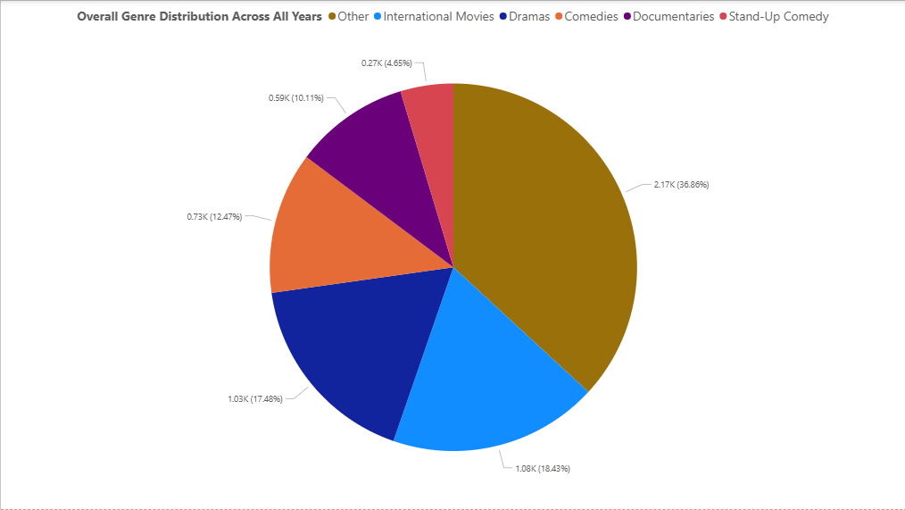

# 📊 Netflix Movies & TV Shows – Big Data Analysis

**Course:** DS8003 – Management of Big Data and Big Data Tools
**Group:** 10
**Members:**

* Ishrat Jaben Bushra
* Sahil Arora
* Sam Ensafi

---

## 📌 Project Overview

This project  implements a batch ETL (Extract, Transform, Load) pipeline to analyze the **Netflix Movies & TV Shows** dataset using a complete big-data pipeline built with:

* **HDFS** for distributed storage, Raw CSV data is extraction
* **Apache Spark** for transforming through data cleaning, preprocessing, and analytics
* **Hive** To Load and for SQL-based querying
* **ElasticSearch & Kibana** for dashboard visualizations

The analysis answers five questions related to catalog balance, genre trends, country representation, maturity ratings, and duration trends.

---

## 📂 Dataset

We used the Netflix Titles dataset (8,807 rows) with features such as title, type, director, cast, country, rating, and duration.

Key points:

* No duplicate show IDs
* Missing values mainly in `director`, `country`, and `cast`
* Duration cleaned: minutes for Movies, seasons for TV Shows

---
## 🔄 ETL Workflow
**Extract**
* Ingested raw Netflix CSV dataset into HDFS
* Accessed data using PySpark and Hive external tables
  
**Transform**
* Performed data cleaning and normalization
* Handled missing values and standardized formats
* Extracted and normalized duration values
* Exploded multi-valued genres with equal-share weighting
* Exploded multi-country entries for accurate contribution analysis
* Created year-wise aggregated datasets for trend analysis
  
**Load**
* Loaded transformed datasets into Hive for SQL-based analytics
* Exported curated outputs to CSV
* Indexed cleaned datasets into ElasticSearch
* Built interactive dashboards using Kibana
---
## 🛠️ Technologies Used

### **HDFS**

* Stores the raw dataset
* Provides distributed storage for Spark, Hive, and downstream tools

### **Apache Spark**

Used for:

* Data cleaning & normalization
* Duration extraction & imputation
* Genre explosion with equal-share weighting
* Country explosion for multi-country entries
* Yearly trend analysis (genres, country, duration)

### **Hive**

Used for:

* Movie vs TV Show counts
* Maturity rating distributions
* SQL queries directly over HDFS
* Quick analytical aggregation

### **ElasticSearch & Kibana**

Used for:

* Indexing cleaned CSV outputs
* Creating visual dashboards (bar, line, pie, trend charts)

---

## ❓ Analytical Questions & Insights

### **Q1 — Movies vs TV Shows**

* ~6100 Movies vs ~2700 TV Shows
* Movies dominate by more than 2×
* TV shows mostly have only 1 season
* → Weak long-term retention opportunity

### **Q2 — Genre Diversity Over Time**

* Catalog shifted to fewer dominant genres
* Dramas & International content increased
* Documentaries & Stand-Up declined
* → Genre diversity shrinking

### **Q3 — Country Contribution**

* Strong dominance by the United States (~3800 titles)
* India and UK follow far behind
* → Heavy dependence on U.S. content

### **Q4 — Maturity Ratings**

* TV-MA and TV-14 together = over 60% of catalog
* Kids & family content <10%
* → Netflix prioritizes adult audience

### **Q5 — Duration Trends**

* Movies getting longer (77 → 100+ minutes)
* TV shows getting shorter (4.6 → ~2 seasons)
* → Less long-term viewer attachment potential

---
## Preview

## 📈 Overall Summary

Across all questions, Netflix shows strong imbalance in catalog strategy:

* More movies than TV shows
* Concentration in a few popular genres
* U.S. content dominates globally
* Mostly adult-oriented catalog
* Longer movies but shorter series

These trends indicate focus on fast production and trend-based content rather than balanced long-term viewer engagement.

---

